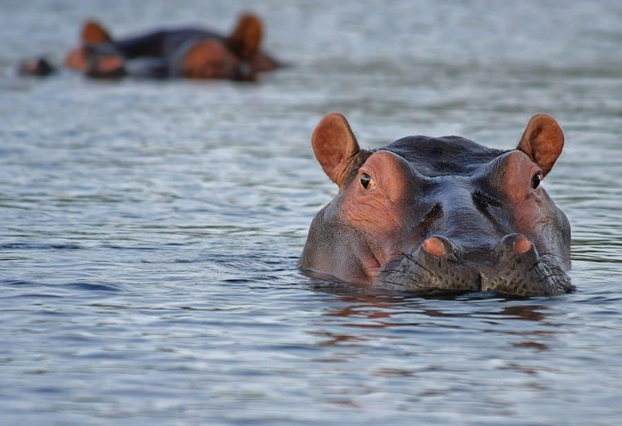

# What is a seahorse?

### A seahorse is any of 46 species of small marine bony fish in the genus Hippocampus. The genus name comes from the Ancient Greek hippókampos (ἱππόκαμπος), itself from híppos (ἵππος) meaning "horse" and kámpos (κάμπος) meaning "sea monster" or "sea animal".

 
 
 

# What is a river horse?

### hippopotamus, its name comes from the ancient Greek for "river horse" (ἱπποπόταμος). 

 
 
 

# What is a water horse?
